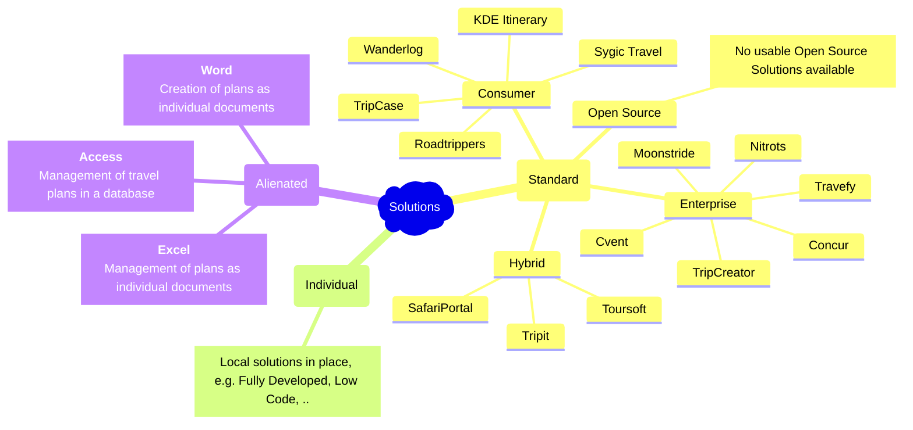

# Market Evaluation

```mermaid
mindmap
  root)Solutions(
    (Standard)
        Consumer
        ::icon(fa fa-user)
            Roadtrippers
            Wanderlog
            KDE Itinerary
            Sygic Travel
            TripCase
        Enterprise
        ::icon(fa fa-building)
            Concur
            Nitrots
            TripCreator
            Travefy
            Moonstride
            Cvent
        Hybrid
        ::icon(fa fa-building-user)
            Tripit
            Toursoft
            SafariPortal
        Open Source
            OpenSource2["`No usable Open Source Solutions available`"]
    (Individual)
        Individual2["`Local solutions in place, e.g. Fully Developed, Low Code, ..`"]
        ::icon(fa fa-code)
    (Alienated)
        Excel["`**Excel**
        Management of plans as individual documents`"]
        ::icon(fa fa-file-excel)
        Access["`**Access**
        Management of travel plans in a database`"]
        ::icon(fa fa-database)
        word["`**Word**
        Creation of plans as individual documents`"]
        ::icon(fa fa-file-word)
```
