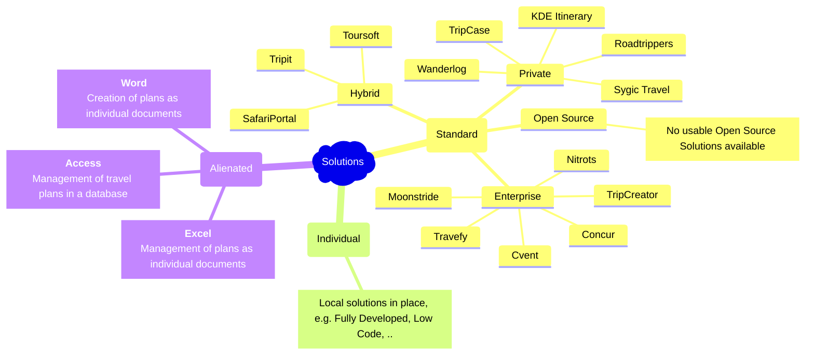

# Market Evaluation

```mermaid
mindmap
  root)Solutions(
    (Standard)
        Private
            Roadtrippers
            Wanderlog
            KDE Itinerary
            Sygic Travel
            TripCase
        Enterprise
            Concur
            Nitrots
            TripCreator
            Travefy
            Moonstride
            Cvent
        Hybrid
            Tripit
            Toursoft
            SafariPortal
        Open Source
            OpenSource2["`No usable Open Source Solutions available`"]
    (Individual)
        Individual2["`Local solutions in place, e.g. Fully Developed, Low Code, ..`"]
    (Alienated)
        Excel["`**Excel**
        Management of plans as individual documents`"]
        Access["`**Access**
        Management of travel plans in a database`"]
        word["`**Word**
        Creation of plans as individual documents`"]
```
